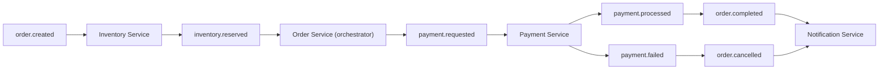

# 🛒 Plataforma de Pedidos — Event-Driven com Spring Boot

Sistema de pedidos de e-commerce baseado em **arquitetura orientada a eventos**, utilizando **Spring Boot** e mensageria para comunicação assíncrona entre serviços.

O sistema simula um fluxo real de processamento de pedidos com:

* consistência eventual
* resiliência parcial
* baixo acoplamento entre serviços
* orquestração baseada em saga

---

# 🎯 Objetivo do Sistema

O sistema foi construído para demonstrar um fluxo distribuído de pedidos onde:

* serviços não se comunicam via HTTP entre si
* eventos são o único meio de integração
* o **Order Service atua como orquestrador da saga**
* cada serviço possui responsabilidade isolada

---

# 🧱 Visão Arquitetural

```text
Client
  │
  ▼
Order Service (API REST + Saga Orchestrator)
  │
  ▼
RabbitMQ (Event Broker)
  │
  ├── Inventory Service
  ├── Payment Service
  └── Notification Service
```

---

# 🔄 Fluxo de Eventos (Implementado)

O fluxo atual do sistema segue uma **saga orquestrada pelo Order Service**:

```text
order.created
   ↓
Inventory Service
   ↓
inventory.reserved
   ↓
Order Service
   ↓
payment.requested
   ↓
Payment Service
   ↓
payment.processed / payment.failed
   ↓
Order Service
   ↓
order.completed / order.cancelled
   ↓
Notification Service
```

---

## 📊 Diagrama do fluxo



---

# 📦 Serviços

---

## 🧭 Order Service (Orquestrador da Saga)

Responsável por:

* criar pedidos via API REST
* publicar `order.created`
* receber eventos:

  * `inventory.reserved`
  * `payment.processed`
  * `payment.failed`
* orquestrar o fluxo da saga
* atualizar status do pedido
* publicar:

  * `payment.requested`
  * `order.completed`
  * `order.cancelled`

---

## 📦 Inventory Service

Responsável por:

* consumir `order.created`
* validar estoque
* reservar itens
* publicar `inventory.reserved`

---

## 💳 Payment Service

Responsável por:

* consumir `payment.requested`
* processar pagamento (mock)
* publicar:

  * `payment.processed`
  * `payment.failed`

---

## 🔔 Notification Service

Responsável por:

* consumir eventos finais:

  * `order.completed`
  * `order.cancelled`
* registrar notificações (log simulado)

---

# 🧠 Conceitos aplicados

---

## Event-Driven Architecture

Serviços se comunicam exclusivamente via eventos assíncronos.

---

## Saga Orchestration

O Order Service coordena o fluxo completo do pedido, controlando transições de estado.

---

## Consistência eventual

O estado final do pedido é alcançado progressivamente através dos eventos.

---

## Idempotência (parcial)

O sistema ainda não possui controle completo de eventos duplicados.

---

## Comunicação assíncrona

Todos os fluxos são baseados em mensagens via RabbitMQ.

---

# ⚙️ Stack utilizada

* Java 17+
* Spring Boot
* Spring AMQP (RabbitMQ)
* Docker + docker-compose
* PostgreSQL (por serviço)

---

# 🐳 Infraestrutura

* RabbitMQ como broker de eventos
* PostgreSQL por serviço (persistência isolada)

---

# 📊 Modelo de Evento

```json
{
  "eventId": "uuid",
  "type": "order.created",
  "timestamp": "2026-01-01T10:00:00Z",
  "payload": {
    "orderId": 1,
    "items": [
      {
        "productId": 10,
        "quantity": 2
      }
    ]
  }
}
```

---

# 📈 O que foi entregue

O sistema implementa:

* criação de pedidos via API REST
* processamento distribuído via eventos
* orquestração de saga no Order Service
* integração entre Inventory, Payment e Notification
* fluxo completo de pedido até finalização ou cancelamento

---

# 🧪 Comportamento do sistema

## Fluxo de sucesso

```text
order.created → inventory.reserved → payment.processed → order.completed → notification
```

---

## Fluxo de falha

```text
order.created → inventory.reserved → payment.failed → order.cancelled → notification
```

---

# ⚠️ Pendências e melhorias futuras

O sistema ainda possui evoluções planejadas:

## 🔁 Resiliência

* retry automático em consumers
* Dead Letter Queue (DLQ)
* backoff em falhas transitórias

---

## 🧾 Idempotência

* controle de `eventId` para evitar duplicidade de processamento

---

## 📊 Observabilidade

* logs estruturados com correlationId
* métricas básicas de processamento

---

## 🧠 Evoluções arquiteturais

* implementação de Outbox Pattern
* melhoria de consistência entre banco e eventos
* possível introdução de API Gateway